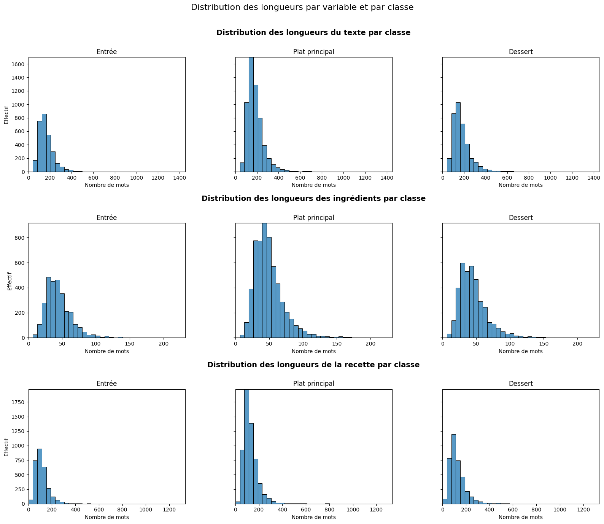
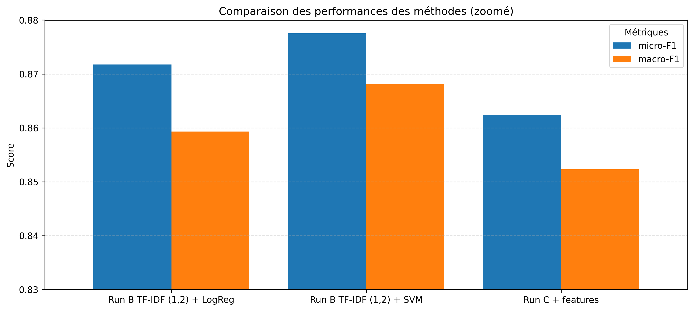

# DEFT2013 Tâche 2

**Dabin Yanis** — **Mhabrech Ilef**

## Description de la tâche

Le projet porte sur la classification automatique de recettes de cuisine à partir des fichiers `train.csv` et `test.csv`. Chaque ligne correspond à une recette décrite par plusieurs champs textuels et annotée par une catégorie cible dans le jeu d’entraînement. L’objectif est de prédire automatiquement le type de recette parmi trois classes :

- Entrée
- Plat principal
- Dessert

Il s’agit donc d’un problème de classification supervisée multiclasse : à partir d’exemples annotés dans le jeu d’entraînement, le modèle doit apprendre à associer une recette à la bonne catégorie.

### Structure du jeu de données

Chaque recette contient plusieurs champs textuels et métadonnées, notamment :

- un identifiant de document (`doc_id`)
- un titre
- une liste d’ingrédients
- un texte de recette
- parfois d’autres informations comme la difficulté
- et surtout le type de la recette, qui constitue la variable cible à prédire

Exemple de contenu de `train.csv` :

- doc_id : `recette_221358.xml`
- Titre : *Feuilleté de saumon et de poireau, sauce aux crevettes*
- Type : *Plat principal*
- Difficulté : *Facile*
- Ingrédients : *1 gros pavé de saumon - 100 g de crevettes ...*
- Recette : *Couper finement le blanc et un peu de vert des poireaux en rondelle...*

Dans ce projet, nous avons choisi de nous concentrer sur les trois champs textuels suivants :

- Titre
- Ingrédients
- Recette

Ce choix est motivé par le fait que ce sont les champs les plus informatifs pour la tâche. Ce sont aussi ceux sur lesquels il est possible de mener une véritable analyse textuelle et d’en tirer des résultats interprétables : longueur des textes, vocabulaire spécifique, mots discriminants, expressions caractéristiques, etc. À l’inverse, les autres métadonnées sont soit moins riches linguistiquement, soit moins directement utiles pour distinguer les trois classes.

### Entrées et sortie

- Entrées : Titre, Ingrédients, Recette
- Sortie : Type de la recette (Entrée / Plat principal / Dessert)


## Installation et exécution

### Installation

```bash
pip install -r requirements.txt
```

### Exécution

Se placer dans le dossier `src`, lancer Jupyter Notebook, puis ouvrir le notebook du projet et exécuter toutes les cellules dans l’ordre pour reproduire les expériences, les tableaux et les figures.

---

## Protocole expérimental

Afin de garantir la comparabilité des résultats, nous avons respecté le protocole expérimental suivant :

- Le découpage train/test fourni a été respecté
- Le jeu de test n’a jamais été utilisé pour l’entraînement
- Toutes les expériences utilisent le même protocole
- `random_state` fixé à 42 pour garantir la reproductibilité

## Statistiques corpus

Nous avons réalisé une analyse exploratoire du corpus afin de mieux comprendre les données avant modélisation.

### Nombre de documents

Le corpus est composé de :

- Train : 12 473 documents
- Test : 1 388 documents

### Répartition des classes

La distribution des classes dans les jeux d’entraînement et de test est présentée dans la figure suivante :


Comme on peut l’observer, la distribution est très similaire entre train et test, ce qui garantit une bonne cohérence expérimentale.
On remarque également un déséquilibre des classes, les plats principaux étant majoritaires.

---

### Statistiques des longueurs (mots)

Nous avons analysé la longueur des champs ingrédients, recette et texte complet. Globalement, les ingrédients sont les plus courts (47.17 mots en moyenne), la recette est plus longue (123.55 mots), et le texte complet atteint 175.85 mots.

| Champ        | Moyenne | Médiane | Min | Max |
|-------------|--------:|--------:|----:|----:|
| Ingrédients | 47.17   | 43      | 7   | 232 |
| Recette     | 123.55  | 109     | 9   | 1334 |
| Texte total | 175.85  | 159     | 25  | 1450 |

Par classe, les plats principaux sont en moyenne les plus longs, les entrées les plus courtes, et les desserts occupent une position intermédiaire. Les écarts restent toutefois modérés, ce qui suggère que la longueur seule ne suffit pas à distinguer clairement les catégories.



Les distributions sont globalement asymétriques à droite, avec quelques recettes très longues. Cette information peut être utile en complément, mais elle reste moins discriminante que le vocabulaire pour la classification.

---

### Spécificités lexicales

Pour repérer les mots les plus caractéristiques de chaque classe, nous avons calculé un ratio de spécificité :

`ratio = fréquence dans la classe / fréquence hors classe`

Les résultats montrent surtout que les desserts possèdent le vocabulaire le plus discriminant, avec des termes comme *biscuit* ou *ganache*, très rarement observés dans les autres classes. À l’inverse, les classes Entrée et Plat principal ont un lexique plus proche, même si certains mots restent indicatifs, par exemple *huîtres* ou *avocats* pour les entrées, et *cailles* ou *pintade* pour les plats principaux.


Cette analyse confirme que les desserts sont les plus faciles à classifier, tandis que la principale difficulté du problème vient de la proximité lexicale entre Entrée et Plat principal.


## Choix de la représentation textuelle

Avant de comparer plusieurs algorithmes, nous avons étudié l’impact du champ utilisé en entrée :

- titre seul
- recette seule
- texte complet (titre + ingrédients + recette)

Nous avons réalisé les expériences sur le même modèle, nous avons seulement changé l’entrée pour chaque run.

| Méthode       | micro-F1 | macro-F1 | accuracy |
|---------------|---------:|---------:|---------:|
| Titre seul    | 0.823217 | 0.807939 | 0.823217 |
| Recette seule | 0.860820 | 0.845284 | 0.860820 |
| Texte complet | 0.870440 | 0.857163 | 0.870440 |

### Les titres seuls sont-ils discriminants ?

Les titres seuls sont déjà assez discriminants, ce qui montre qu’ils contiennent souvent des indices lexicaux forts sur le type de recette. Mais ils ne suffisent pas toujours à bien distinguer les entrées des plats.

### Les instructions seules suffisent-elles ?

Les instructions permettent d’obtenir de bonnes performances, supérieures à celles du titre seul. Elles contiennent une information très utile pour la classification.
Le texte complet reste meilleur, ce qui montre que les autres champs apportent une information complémentaire.

### Certaines recettes semblent-elles ambiguës ?

Oui, les chiffres montrent que l’ambiguïté concerne surtout Entrée et Plat principal. Avec le texte complet, 865 entrées sont classées comme plats, et 643 plats comme entrées.
À l’inverse, les desserts sont beaucoup plus faciles à reconnaître (F1 = 0.986, contre 0.717 pour Entrée).

### Visualisation

La figure suivante synthétise les performances obtenues selon le champ utilisé :


## Méthodes proposées

### Run1: baseline aléatoire

**Description de la méthode :**
- descripteurs utilisés : aucun
- classifieur utilisé : attribution aléatoire d’une classe parmi Entrée, Plat principal et Dessert

Cette première baseline constitue la référence minimale. Comme aucune information issue du texte n’est exploitée, les prédictions sont distribuées au hasard entre les trois classes, ce qui conduit à des performances faibles (micro-F1 : 0.316, macro-F1 : 0.309, accuracy : 0.316). Ce résultat était attendu (environ 1/3) et confirme que la tâche ne peut pas être résolue correctement sans exploiter le contenu textuel des recettes.

### Run2: baseline majoritaire

**Description de la méthode :**
- descripteurs utilisés : aucun
- classifieur utilisé : prédiction systématique de la classe majoritaire, Plat principal

Cette seconde baseline prédit toujours la classe la plus fréquente du corpus, ce qui améliore mécaniquement l’accuracy (0.464) par rapport au hasard. En revanche, la macro-F1 chute fortement (0.211), car le modèle ne reconnaît jamais les classes Entrée et Dessert. Cette méthode met donc bien en évidence l’effet du déséquilibre des classes et montre que l’accuracy seule peut donner une impression trompeuse des performances réelles.

### Run3: TF-IDF + Naive Bayes

**Description de la méthode :**
- descripteurs utilisés : vecteurs TF-IDF en unigrammes
- classifieur utilisé : Multinomial Naive Bayes

Cette méthode représente chaque recette par un sac de mots pondéré par TF-IDF, puis applique un classifieur Naive Bayes multinomial. Elle obtient de bons résultats globaux (micro-F1 : 0.805, macro-F1 : 0.732), car certains mots sont très caractéristiques de certaines classes, en particulier pour les desserts, dont le vocabulaire est souvent spécifique. En revanche, le modèle suppose une indépendance forte entre les mots et exploite peu le contexte, ce qui le pénalise pour distinguer les entrées des plats principaux, deux classes lexicalement plus proches.

### Run4: TF-IDF + Logistic Regression

**Description de la méthode :**
- descripteurs utilisés : vecteurs TF-IDF avec n-grammes (1,2)
- classifieur utilisé : régression logistique

Cette méthode enrichit la représentation avec des unigrammes et des bigrammes, puis utilise une régression logistique, un modèle linéaire bien adapté à la classification de textes. Les performances progressent nettement (micro-F1 : 0.872, macro-F1 : 0.859), car les n-grammes permettent de mieux capturer des expressions plus informatives que des mots isolés, ce qui aide à mieux différencier les classes. Le modèle devient ainsi plus équilibré, notamment sur la classe Entrée.

### Run5: TF-IDF + SVM linéaire

**Description de la méthode :**
- descripteurs utilisés : vecteurs TF-IDF avec unigrammes et bigrammes
- classifieur utilisé : SVM linéaire (LinearSVC)

Le SVM linéaire repose sur la même représentation TF-IDF que la méthode précédente, mais apprend une frontière de décision plus robuste entre les classes. C’est le meilleur modèle testé (micro-F1 : 0.878, macro-F1 : 0.868), ce qui est cohérent avec l’efficacité habituelle des SVM sur des données textuelles de grande dimension. Il réduit davantage les confusions entre Entrée et Plat principal, tout en conservant d’excellents résultats sur Dessert.

### Run6: Run C sans enrichissement

**Description de la méthode :**
- descripteurs utilisés : vecteurs TF-IDF (1,2) sur le texte tokenisé
- classifieur utilisé : SVM linéaire (LinearSVC)

Pour construire la méthode C, nous sommes partis de notre meilleur modèle précédent, Run B TF-IDF (1,2) + SVM. Nous l’avons repris dans une version compatible avec l’ajout de variables supplémentaires, en conservant la même logique de représentation textuelle mais avec une mise en forme tokenisée permettant ensuite d’intégrer d’autres features dans le pipeline. Cette version sert donc de point de comparaison direct pour évaluer l’effet des enrichissements manuels. Les performances restent élevées (micro-F1 : 0.872, macro-F1 : 0.863), ce qui confirme que la base textuelle issue du modèle B reste solide même après cette adaptation technique.

### Run7: Run C + features

**Description de la méthode :**
- descripteurs utilisés :
  - vecteurs TF-IDF (1,2) sur le texte tokenisé
  - présence de mots spécifiques par classe
  - longueur du texte
  - nombre d’ingrédients
- classifieur utilisé : SVM linéaire (LinearSVC)

Dans cette version enrichie, nous avons ajouté manuellement plusieurs variables issues de l’exploration des données. D’abord, nous avons exploité les résultats sur les spécificités lexicales pour créer des features liées à la présence de mots particulièrement caractéristiques de chaque classe. Ensuite, nous avons ajouté deux variables quantitatives simples : la longueur du texte et le nombre d’ingrédients, en partant de l’hypothèse que certaines classes, comme les plats principaux, sont en moyenne un peu plus longues ou plus riches en ingrédients que d’autres.

Les résultats de cette version enrichie (micro-F1 : 0.862, macro-F1 : 0.852) sont cependant légèrement inférieurs à ceux de la version sans enrichissement. Cela suggère que les informations ajoutées manuellement n’apportent pas de signal réellement nouveau par rapport à ce qui est déjà capturé par le TF-IDF avec n-grammes. Les mots spécifiques sont souvent déjà bien pris en compte par la représentation textuelle, et les variables globales comme la longueur ou le nombre d’ingrédients restent trop peu discriminantes pour améliorer la séparation des classes. L’ajout de ces features peut même introduire un peu de bruit ou déséquilibrer la représentation, ce qui peut expliquer la légère baisse observée.

## Résultats

| Méthode                      | micro-F1 | macro-F1 | accuracy |
|-----------------------------|---------:|---------:|---------:|
| Baseline aléatoire          | 0.315562 | 0.309255 | 0.315562 |
| Baseline majoritaire        | 0.463977 | 0.211286 | 0.463977 |
| Run A unigrammes + NB       | 0.805476 | 0.732264 | 0.805476 |
| Run B TF-IDF (1,2) + LogReg | 0.871758 | 0.859328 | 0.871758 |
| Run B TF-IDF (1,2) + SVM    | 0.877522 | 0.868079 | 0.877522 |
| Run C sans enrich.          | 0.872478 | 0.862581 | 0.872478 |
| Run C + features            | 0.862392 | 0.852330 | 0.862392 |




Dans notre cas, l’accuracy est égale au micro-F1, car chaque recette appartient à une seule classe. Nous avons donc choisi de ne pas l’afficher pour une meilleure lisibilité.

Comme on peut le voir :

- Les modèles linéaires sont nettement meilleurs
- Le passage aux n-grammes améliore les performances
- Le SVM donne les meilleurs résultats globaux
- Le problème principal reste la distinction Entrée vs Plat principal

# Analyse des résultats

## Analyse quantitative

### Score global

Les baselines montrent bien que la tâche n’est pas triviale :

- Baseline aléatoire : très mauvais résultats.
- Baseline majoritaire : accuracy correcte en apparence, mais très mauvais macro-F1 car elle ignore les classes minoritaires.

La figure de comparaison des méthodes montre que **Run B TF-IDF (1,2) + SVM** est le meilleur modèle, avec les meilleurs scores globaux.

Le modèle Naive Bayes (méthode A) améliore nettement les baselines, mais reste moins performant que les modèles linéaires sur TF-IDF. Le SVM est légèrement meilleur que la régression logistique.

Le macro-F1 permet ici de mieux évaluer la qualité réelle des modèles, car il donne le même poids à chacune des trois classes, même lorsqu’elles sont déséquilibrées. On observe que les classifieurs linéaires, en particulier la régression logistique et le SVM linéaire, obtiennent les meilleurs scores en macro-F1. Cela montre qu’ils ne se contentent pas d’être performants globalement, mais qu’ils restent aussi mieux équilibrés entre Entrée, Plat principal et Dessert. À l’inverse, la baseline majoritaire illustre bien la limite d’une lecture fondée uniquement sur l’accuracy.


L’écart reste faible entre Run B TF-IDF (1,2) + Logistic Regression et Run B TF-IDF (1,2) + SVM, ce qui montre que les deux modèles sont solides. Le SVM s’avère toutefois légèrement meilleur pour maintenir de bonnes performances sur l’ensemble des classes.

### Score par classe

Avec le meilleur modèle, la figure du F1-score par classe montre que Dessert est presque parfaitement reconnu, et que les plats principaux sont eux aussi bien reconnus.

La principale faiblesse du modèle concerne donc la détection des entrées (F1-score de 0.739).


### Matrice de confusion

Pour la matrice de confusion, nous avons généré deux heatmaps afin d’analyser les résultats : une avec les valeurs brutes et l’autre avec les valeurs normalisées. Un score de 1 sur la matrice normalisée indique une prédiction parfaite pour la classe concernée.

La matrice montre que Dessert est presque toujours bien classé. Il y a très peu de confusion entre Dessert et les classes salées, tandis que la plupart des erreurs viennent de la confusion entre Entrée et Plat principal.

Généralement, Entrée → Plat principal est l’erreur la plus fréquente, même si l’on observe aussi des erreurs Plat principal → Entrée, mais de façon moins fréquente.

Cela montre que la vraie difficulté du problème n’est pas de distinguer sucré / salé, mais plutôt de séparer correctement Entrée et Plat principal.


### Impact du déséquilibre

Le jeu de données est déséquilibré : la classe Plat principal est plus représentée que les autres.

Cela a pour conséquence que la baseline majoritaire obtient une accuracy artificiellement correcte. Cela justifie l’utilisation du macro-F1, qui donne la même importance à chacune des classes et qui doit donc être utilisé en complément de l’accuracy.

Le déséquilibre pénalise surtout la classe Entrée, qui est à la fois moins représentée et plus proche lexicalement de Plat principal.

#### Répartition des classes


## Analyse qualitative

### Exemples de bonnes prédictions

Les bonnes prédictions concernent surtout les desserts, car cette classe possède un vocabulaire très spécifique.

Les performances par classe montrent que Dessert est presque parfaitement reconnu, ce qui indique que certains mots donnent des indices très forts au modèle.

Comme on le voit sur la figure des mots les plus spécifiques par classe, les mots associés aux desserts ont des ratios de spécificité beaucoup plus élevés que ceux des autres classes. Des termes comme biscuit, ganache, pralin, chocolat ou pâtissière sont très fortement liés à la classe Dessert. Cela montre que le vocabulaire des desserts est plus discriminant, ce qui explique pourquoi cette classe est la mieux prédite.

On observe aussi que les titres seuls sont déjà assez informatifs. Pour certaines recettes, le nom contient directement des indices de classe, ce qui augmente les chances d’une bonne prédiction même sans analyser tout le texte.


### Exemples d’erreurs typiques

Les erreurs typiques concernent principalement la confusion entre Entrée et Plat principal.

Les recettes salées partageant des ingrédients proches, un mode de préparation similaire ou un intitulé peu explicite sont les plus difficiles à classer correctement. En pratique, l’erreur typique n’est donc pas de confondre un dessert avec un plat, mais plutôt de mal séparer deux recettes salées proches.

### Recettes ambiguës

Les recettes ambiguës sont surtout celles situées à la frontière entre Entrée et Plat principal.

L’exploration menée dans le notebook montre déjà cette tendance : même avec le texte complet, l’ambiguïté reste forte entre ces deux classes, alors que Dessert reste beaucoup plus facile à reconnaître.

Cette ambiguïté peut venir du fait que certaines recettes peuvent raisonnablement être servies soit en petite portion comme entrée, soit en portion plus importante comme plat principal. Le problème ne vient donc pas seulement du modèle, mais aussi du fait que la frontière entre ces deux catégories est parfois floue dans les données elles-mêmes.

### Différences entre Entrée et Plat principal

La différence entre Entrée et Plat principal est moins nette que celle entre Dessert et les recettes salées. Les figures montrent que le modèle a plus de mal à séparer ces deux classes, ce qui suggère qu’elles partagent une partie de leur vocabulaire et de leur structure.

Les plats principaux semblent globalement mieux reconnus que les entrées, probablement parce qu’ils sont plus nombreux dans le corpus et qu’ils présentent des indices lexicaux plus stables. À l’inverse, les entrées forment une catégorie plus hétérogène, ce qui rend leur détection plus difficile.

Les statistiques de longueur vont dans le même sens : les plats principaux sont en moyenne un peu plus longs que les entrées, aussi bien pour les ingrédients que pour la recette complète. Cependant, les écarts restent modestes, ce qui montre que la longueur seule ne suffit pas à distinguer clairement les classes. Elle peut aider en complément, mais le vocabulaire reste l’indice le plus discriminant.

#### Statistiques de longueur des ingrédients

| Classe         | count | mean | std | min | median | max |
|:---------------|------:|-----:|----:|----:|-------:|----:|
| Dessert        | 3762 | 45.55 | 21.32 | 7 | 41 | 223 |
| Entrée         | 2909 | 44.44 | 18.95 | 8 | 41 | 149 |
| Plat principal | 5802 | 49.59 | 22.05 | 8 | 46 | 232 |
| Total          | 12473 | 47.17 | 21.26 | 7 | 43 | 232 |

#### Statistiques de longueur de la recette

| Classe         | count | mean | std | min | median | max |
|:---------------|------:|-----:|----:|----:|-------:|----:|
| Dessert        | 3762 | 125.56 | 77.35 | 9 | 108 | 1334 |
| Entrée         | 2909 | 112.62 | 58.33 | 14 | 101 | 638 |
| Plat principal | 5802 | 127.73 | 65.01 | 13 | 114 | 1213 |
| Total          | 12473 | 123.55 | 67.83 | 9 | 109 | 1334 |

#### Statistiques de longueur du texte

| Classe         | count | mean | std | min | median | max |
|:---------------|------:|-----:|----:|----:|-------:|----:|
| Dessert        | 3762 | 176 | 90.84 | 33 | 155 | 1450 |
| Entrée         | 2909 | 162.2 | 69.33 | 25 | 149 | 763 |
| Plat principal | 5802 | 182.59 | 78.81 | 44 | 166.5 | 1440 |
| Total          | 12473 | 175.85 | 81.01 | 25 | 159 | 1450 |


## Interprétabilité

### Quels mots sont les plus discriminants ?

La figure des mots les plus spécifiques par classe montre que certains termes sont très fortement associés à une seule catégorie.

- Dessert : biscuit, ganache, pralin, chocolat, pâtissière, meringue, biscuits, frangipane
- Entrée : dénervé, huîtres, rémoulade, dolmas, cassolettes, samoussa, émulsionnant, tourin
- Plat principal : cailles, pintade, gnocchis, côtelettes, chapon, seiches, gigot, macaroni

On remarque surtout que les mots associés à Dessert ont des ratios de spécificité beaucoup plus élevés que ceux des autres classes, ce qui confirme que le vocabulaire des desserts est le plus discriminant.


### Pourquoi la meilleure méthode fonctionne-t-elle ?

**TF-IDF (1,2) + SVM** fonctionne bien pour deux raisons principales. D’abord, TF-IDF met en valeur les mots les plus informatifs pour la classification et réduit l’importance des mots trop fréquents. Ensuite, l’utilisation des bigrammes permet de capturer de petites expressions plus précises que les unigrammes seuls.

Cette méthode fonctionne particulièrement bien sur Dessert, car cette classe possède un vocabulaire très spécifique, mais elle reste plus en difficulté sur la séparation entre Entrée et Plat principal, qui partagent un lexique plus proche.


## Réflexion critique sur le projet

### La tâche est-elle bien définie ?

Oui, dans l’ensemble la tâche est bien définie. On sait exactement ce qu’on donne au modèle en entrée, le titre, les ingrédients et la recette, et ce qu’on attend en sortie, une seule classe parmi Entrée, Plat principal et Dessert. D’un point de vue informatique, le problème est donc clair et facile à formuler comme une classification supervisée.

En revanche, même si la tâche est bien définie sur le papier, elle l’est un peu moins dans la réalité. Les catégories ne sont pas toujours totalement nettes, surtout entre Entrée et Plat principal. Donc la consigne est claire, mais les données qu’elle cherche à modéliser ne le sont pas toujours parfaitement.

### Une recette peut-elle appartenir à plusieurs catégories ?

Dans le corpus, non. Chaque recette appartient à une seule catégorie, puisque c’est le principe même de l’annotation utilisée pour entraîner les modèles.

Mais dans le monde réel, oui, cela peut arriver. Certaines recettes peuvent être considérées comme une entrée ou comme un plat selon le contexte, la portion, ou simplement selon la personne qui les juge. Une salade composée, une quiche ou un feuilleté peuvent très bien être servis comme entrée dans un repas, ou comme plat principal dans un autre. Il y a donc une part de subjectivité qui dépasse le cadre strict du jeu de données.

C’est important à souligner, parce que cela veut dire que certaines erreurs du modèle ne viennent pas forcément d’un mauvais apprentissage, mais du fait que la frontière entre les classes est parfois floue dès le départ.

### Les classes sont-elles naturellement séparables ?

Non, elles ne sont pas naturellement séparables. C’est quelque chose qu’on a clairement observé dans nos expériences. La classe Dessert se distingue assez facilement, car elle possède un vocabulaire très spécifique, souvent lié au sucre, à la pâtisserie ou aux préparations sucrées.

En revanche, la frontière entre Entrée et Plat principal est beaucoup plus fine. Ce sont deux classes qui partagent beaucoup d’ingrédients, de formulations et de structures de recettes. C’est d’ailleurs là que se concentrent la majorité des erreurs de classification.

On pourrait pousser cette réflexion avec une représentation visuelle des données, par exemple un nuage de points après réduction de dimension. On verrait probablement que les recettes Entrée et Plat principal se recouvrent en partie, ce qui confirme qu’il n’existe pas de séparation simple et évidente entre elles.

### La macro-F1 est-elle la meilleure métrique ?

Oui, dans notre cas la macro-F1 est la métrique la plus pertinente. Les trois classes ne sont pas représentées en proportions égales dans le corpus, donc il est important d’utiliser une mesure qui donne le même poids à chacune d’elles.

La macro-F1 permet justement de ne pas favoriser artificiellement la classe majoritaire. Elle reflète mieux la capacité du modèle à bien traiter toutes les catégories, y compris celles qui sont plus difficiles ou moins fréquentes. Dans notre projet, c’est particulièrement utile, car un modèle peut sembler bon en score global tout en restant faible sur la classe Entrée.

Le micro-F1 reste quand même intéressant en complément, car il permet d’évaluer l’efficacité globale du modèle. Mais à lui seul, il ne suffit pas pour juger finement la qualité des résultats. C’est donc vraiment la macro-F1 qui nous semble la plus adaptée pour comparer les méthodes de manière équilibrée.

### Vos modèles généralisent-ils réellement ?

Ils généralisent correctement sur le jeu de test fourni, puisqu’ils obtiennent de bons résultats sur des données non vues pendant l’entraînement. Cela montre qu’ils apprennent bien des régularités utiles dans le corpus.

Mais il faut rester prudent. Le fait qu’un modèle fonctionne bien sur ce jeu de test ne garantit pas qu’il fonctionnerait aussi bien sur d’autres recettes venant d’autres sources, avec d’autres styles d’écriture ou d’autres choix d’annotation. Pour affirmer qu’il généralise réellement, il faudrait le tester sur d’autres jeux de données.


### Bilan personnel

Au final, ce projet nous a montré qu’une tâche de classification peut être bien définie d’un point de vue technique, tout en restant imparfaite d’un point de vue humain. La difficulté principale ne vient pas seulement du choix du modèle, mais aussi du fait que certaines recettes sont ambiguës par nature. C’est particulièrement vrai pour la distinction entre Entrée et Plat principal.

Cela explique pourquoi même les meilleurs modèles restent limités sur certains cas. Ce projet nous a donc appris non seulement à comparer des méthodes de classification, mais aussi à prendre du recul sur les données, les métriques et les limites réelles du problème.