# DEFT2013 Tâche 2 : NOMEQUIPE 


**Dabin Yanis - Mhabrech Ilef**  


## Description de la tâche

L’objectif du projet est de **prédire automatiquement le type d’une recette de cuisine** parmi trois classes :
- Entrée
- Plat principal
- Dessert

- **Entrées (inputs)** :
  - Titre
  - Ingrédients
  - Recette 

- **Sortie (output)** :
  - Type de la recette (Entrée / Plat / Dessert)

==> Il s’agit donc d’un problème de **classification supervisée**.

### Exemple de document :
Exemple de contenu de `train.csv` :

- **doc_id** : `recette_221358.xml`
- **Titre** : *Feuilleté de saumon et de poireau, sauce aux crevettes*
- **Type** : *Plat principal*
- **Difficulté** : *Facile*
- **Ingrédients** : *1 gros pavé de saumon - 100 g de crevettes ...*
- **Recette** : *Couper finement le blanc et un peu de vert des poireaux en rondelle...*  
---

## Installation et exécution

### Installation

```bash
pip install -r requirements.txt
```

### Exécution

```bash
cd src
jupyter notebook
```

---
## Protocole expérimental
Afin de garantir la comparabilité des résultats, nous avons respecté le protocole expérimental suivant :

- Le découpage train/test fourni a été respecté
- Le jeu de test n’a jamais été utilisé pour l’entraînement
- Toutes les expériences utilisent le même protocole
- random_state fixé à 42 pour garantir la reproductibilité 

## Statistiques corpus

Nous avons réalisé une analyse exploratoire du corpus :
- distribution des classes
- longueur des recettes
- analyse du vocabulaire
- spécificités lexicales par classe

Pour mieux comprendre les données avant modélisation

### Nombre de documents
Le corpus est composé de :
- Train : 12 473 documents  
- Test : 1 388 documents  

### Répartition des classes
La distribution des classes dans les jeux d’entraînement et de test est présentée dans le tableau suivant :

| Classe          | Train (%) | Test (%) |
|----------------|----------:|---------:|
| Plat principal | 46.5 %    | 46.4 %   |
| Dessert        | 30.2 %    | 29.3 %   |
| Entrée         | 23.3 %    | 24.3 %   |

La figure suivante illustre cette répartition : 


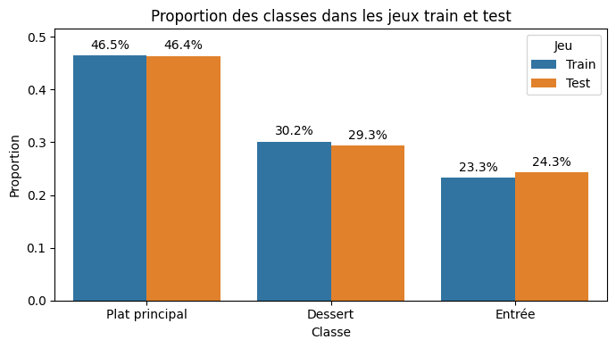
Comme on peut l’observer sur la figure, la distribution est très similaire entre train et test, ce qui garantit une bonne cohérence expérimentale.  
On remarque également un **déséquilibre des classes**, les *plats principaux* étant majoritaires.

---

### Statistiques des longueurs (mots)
Les statistiques descriptives des différents champs textuels sont résumées ci-dessous :

| Champ       | Moyenne | Min | Max |
|------------|--------:|----:|----:|
| ingrédients | 47      | 7   | 232 |
| recette     | 123     | 9   | 1334 |
| texte total | 176     | 25  | -   |


### Distribution des longueurs
Les distributions des longueurs des textes sont présentées dans les figures suivantes.

#### Texte complet
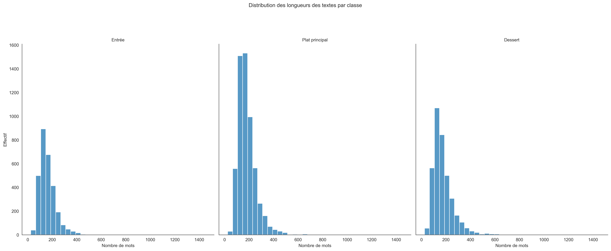

#### Recettes
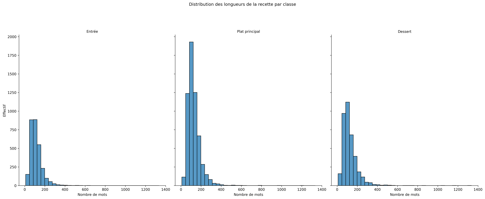

#### Ingrédients
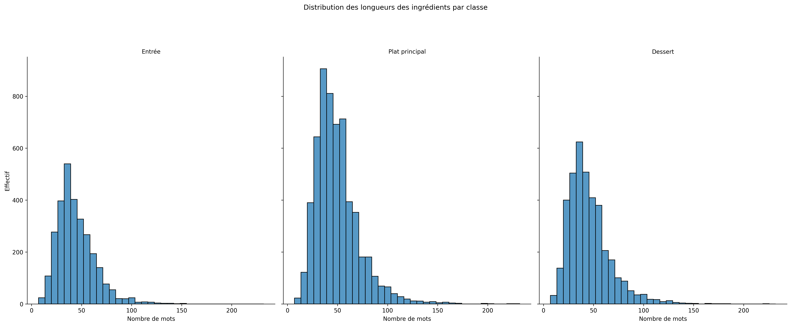

Comme on peut le voir sur ces distributions :
- Les textes sont en moyenne **assez longs (~176 mots)**
- On observe une **forte variabilité**, avec certaines recettes très longues
- Les distributions sont globalement asymétriques, avec une queue vers les grandes longueurs

Ces caractéristiques peuvent influencer la modélisation, notamment pour les méthodes basées sur le texte.

---

### Spécificités lexicales

Afin d’identifier les mots caractéristiques de chaque classe, nous avons calculé un **ratio de spécificité** défini comme :

ratio = fréquence dans la classe / fréquence hors classe

#### Dessert

Exemples marquants :

- **biscuit** → 311 occurrences dans desserts vs 1 hors classe  
  → ratio = 377.38 (extrêmement discriminant)

- **ganache** → 93 dans desserts vs 0 ailleurs  
  → mot exclusivement lié aux desserts

Ces résultats montre que les desserts ont un vocabulaire **très spécifique** , ce qui facilite la classification.

#### Entrée

Exemples :

- **huîtres** → 70 vs 6  
- **avocats** → 175 vs 25  
...  
  
On observe que les entrées sont liées à des aliments **frais, légers ou froids**, mais avec un vocabulaire moins spécifique , classification plus difficile.


#### Plat principal

Exemples :

- **cailles** → 125 vs 0  
- **pintade** → 92 vs 0  

 
Les plats principaux sont associés à des **viandes, plats chauds et plats complets**, avec un vocabulaire riche mais plus varié.

### Visualisation des mots spécifiques
La figure suivante présente les mots les plus spécifiques pour chaque classe :

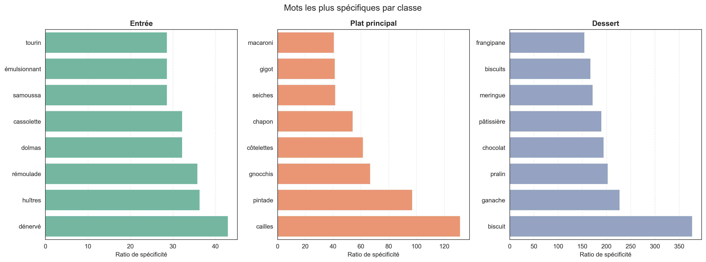

Comme on peut le constater, les mots associés aux desserts ont des ratios de spécificité beaucoup plus élevés, ce qui confirme leur caractère très discriminant.

### interprétations : 
Cette analyse exploratoire met en évidence plusieurs points importants :

- Les **desserts sont les plus faciles à classifier** grâce à un vocabulaire très spécifique  
- Les classes **Entrée et Plat principal sont plus proches**, ce qui entraîne davantage d’erreurs  
- Certaines recettes sont intrinsèquement **ambiguës** (ex : quiches, salades composées)  
- Le **déséquilibre des classes** peut influencer les performances des modèles  
---


# Méthodes proposées

## Choix de la représentation textuelle

Avant de comparer plusieurs algorithmes, nous avons étudié l’impact du champ utilisé en entrée :
- **titre seul**
- **recette seule**
- **texte complet** (titre + ingrédients + recette)

###  Run1 : Titre seul

**Description :**
Utilisation uniquement du titre de la recette comme entrée.

**Résultats :**
- micro-F1 : 0.823  
- macro-F1 : 0.808  

**Analyse :**
- Les titres sont **déjà très informatifs**
- Très bons résultats pour les desserts (F1 ≈ 0.92)
- Difficulté à distinguer **Entrée vs Plat principal**
  
On constate que les titres contiennent des **indices lexicaux forts**, mais insuffisants pour certaines classes.

###  Run2 : Recette seule

**Description :**
Utilisation uniquement des instructions de la recette.

**Résultats :**
- micro-F1 : 0.861  
- macro-F1 : 0.845  

**Analyse :**
- Amélioration nette par rapport au titre
- Les instructions contiennent plus d’information
- Toujours des erreurs entre Entrée et Plat principal
 
Ces résultats montrent que les instructions sont **plus riches que le titre** pour la classification.

###  Run3 : Texte complet

**Description :**
Utilisation de toutes les informations disponibles :
titre + ingrédients + recette

**Résultats :**
- micro-F1 : 0.870  
- macro-F1 : 0.857  

**Analyse :**
- Meilleure performance globale
- Les différentes sources d’information sont **complémentaires**
- Les desserts sont très bien classés (F1 ≈ 0.986)

On interpréte que le texte complet est la meilleure représentation.

### Visualisation : 
La figure suivante synthétise les performances obtenues selon le champ utilisé :

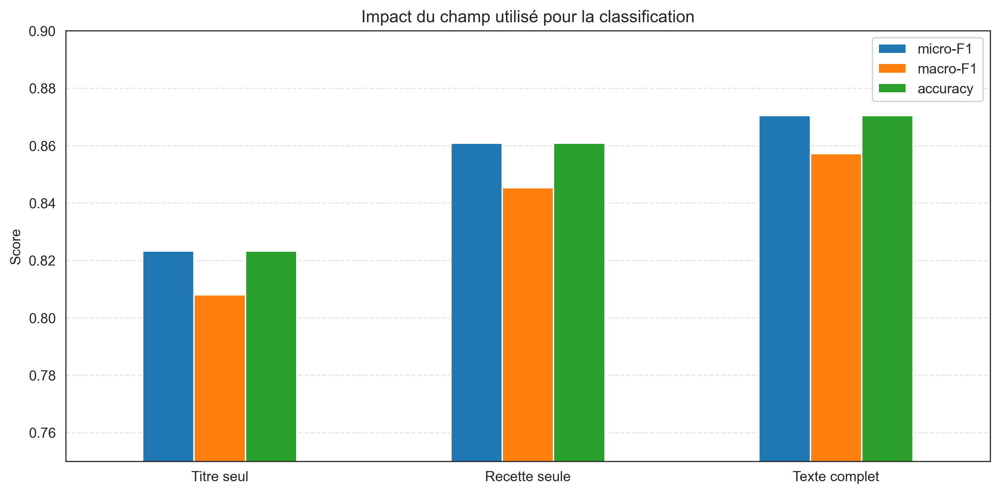
---

###  Réponses aux questions du projet

#### Les titres seuls sont-ils discriminants ?
Oui, les titres seuls donnent déjà de bons résultats (micro-F1 ≈ 0.82). Cela montre qu’ils contiennent souvent des mots clés importants. Cependant, ils ne suffisent pas toujours à distinguer **Entrée** et **Plat principal**.

#### Les instructions seules suffisent-elles ?
Les instructions donnent de meilleures performances (micro-F1 ≈ 0.86). Elles apportent plus de détails (cuisson, ingrédients, techniques). Mais le texte complet reste meilleur : les autres champs apportent donc une information complémentaire.

#### Certaines recettes semblent-elles ambiguës ?
Oui. L’ambiguïté concerne surtout **Entrée** et **Plat principal** :
- 865 entrées classées comme plats
- 643 plats classés comme entrées

À l’inverse, les desserts sont beaucoup plus faciles à reconnaître.

---

## Baselines

Nous avons implémenté deux baselines simples afin d’établir un point de comparaison.

###  Baseline 1 : Aléatoire

**Description :**  
Le modèle attribue une classe au hasard parmi les trois classes possibles.

**Résultats :**
- micro-F1 : 0.316  
- macro-F1 : 0.309  
- accuracy : 0.316  

**Analyse :**
- Les performances sont faibles, proches du hasard.
- La matrice de confusion montre que les prédictions sont réparties aléatoirement.
- Aucune structure n’est capturée.

Conclusion :  
Cette baseline sert uniquement de référence minimale.


###  Baseline 2 : Classe majoritaire

**Description :**  
Le modèle prédit toujours la classe la plus fréquente : **Plat principal**.

**Résultats :**
- micro-F1 : 0.464  
- macro-F1 : 0.211  
- accuracy : 0.464  

**Analyse :**
- L’accuracy est plus élevée que l’aléatoire car la classe majoritaire est souvent correcte.
- Cependant :
  - F1 = 0 pour Dessert et Entrée
  - Le modèle ignore complètement ces classes

Observation importante :
- La **macro-F1 chute fortement** (0.21), ce qui montre que le modèle est très mauvais globalement.
- Ce modèle est fortement biaisé par le déséquilibre des classes.

Conclusion :  
- Bonne accuracy mais modèle inutile en pratique  
- Montre l’importance d’utiliser des métriques adaptées (macro-F1)

###  Interprétation des baselines

Ces deux baselines remplissent bien leur rôle de point de comparaison :

- la baseline **aléatoire** produit des résultats très faibles, proches du hasard
- la baseline **majoritaire** obtient une accuracy plus élevée, mais son **macro-F1 s’effondre**, car elle ignore complètement les classes minoritaires

Cette comparaison montre deux choses importantes :
1. la tâche n’est **pas triviale**
2. l’**accuracy seule peut être trompeuse** dans un contexte de classes déséquilibrées

Ces résultats justifient l’utilisation de modèles plus avancés et l’importance d’évaluer les performances avec le **macro-F1** en complément du micro-F1 et de l’accuracy.

---

## Modèles de classification

Après les baselines, nous avons implémenté plusieurs modèles plus avancés basés sur TF-IDF.

###  Méthode A : TF-IDF + Naive Bayes

**Description :**
- Représentation : TF-IDF (unigrammes)
- Modèle : Multinomial Naive Bayes

**Résultats :**
- micro-F1 : 0.805  
- macro-F1 : 0.732  

**Analyse :**
- Très bon score pour les **desserts (F1 ≈ 0.98)** → vocabulaire très spécifique
- Très mauvais score pour les **entrées (F1 ≈ 0.39)**  
  → beaucoup d’entrées classées comme plats
- Le modèle est biaisé vers les classes dominantes

Conclusion :  
- Modèle simple mais limité  
- Sensible au déséquilibre des classes  
- Mauvaise gestion des classes difficiles (Entrée)

---

###  Méthode B : TF-IDF + Logistic Regression

**Description :**
- Représentation : TF-IDF avec n-grammes (1,2)
- Modèle : Régression logistique

**Résultats :**
- micro-F1 : 0.872  
- macro-F1 : 0.859  

**Analyse :**
- Forte amélioration par rapport à Naive Bayes
- Meilleur équilibre entre les classes
- Entrée mieux reconnue (F1 ≈ 0.72)

Conclusion :  
- Modèle robuste  
- Les **n-grammes apportent du contexte**  
- Bon compromis global

###  Méthode B (variante) : TF-IDF + SVM (LinearSVC)

**Description :**
- Représentation : TF-IDF (uni + bi-grammes)
- Modèle : SVM linéaire

**Résultats :**
- micro-F1 : 0.878  
- macro-F1 : 0.868  

**Analyse :**
- Meilleur modèle global
- Très bonnes performances sur toutes les classes
- Réduction des erreurs entre Entrée et Plat

#### Matrice de confusion

La matrice de confusion suivante montre les performances du modèle SVM :

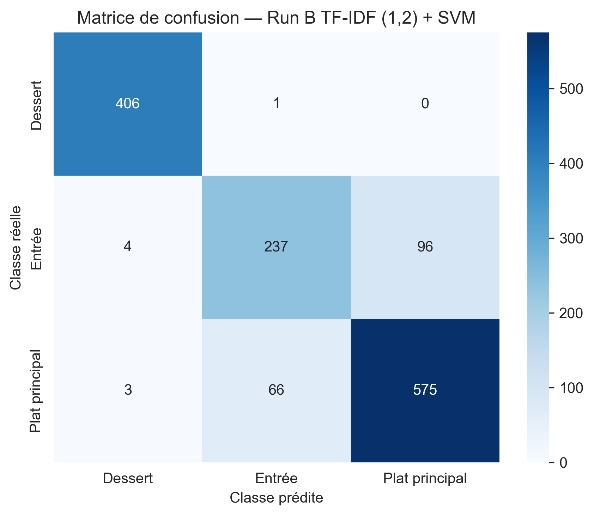

La figure suivante détaille les performances par classe :

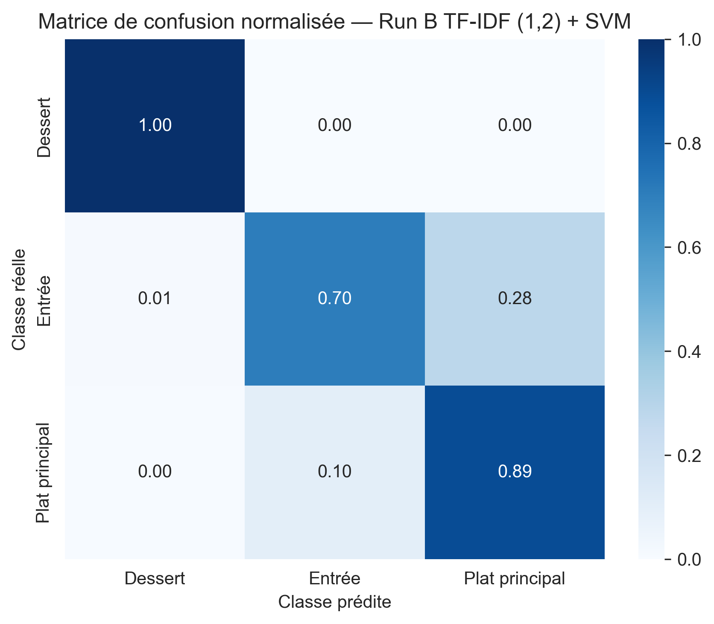

#### F1-score par classe

La figure suivante montre les performances détaillées par classe :

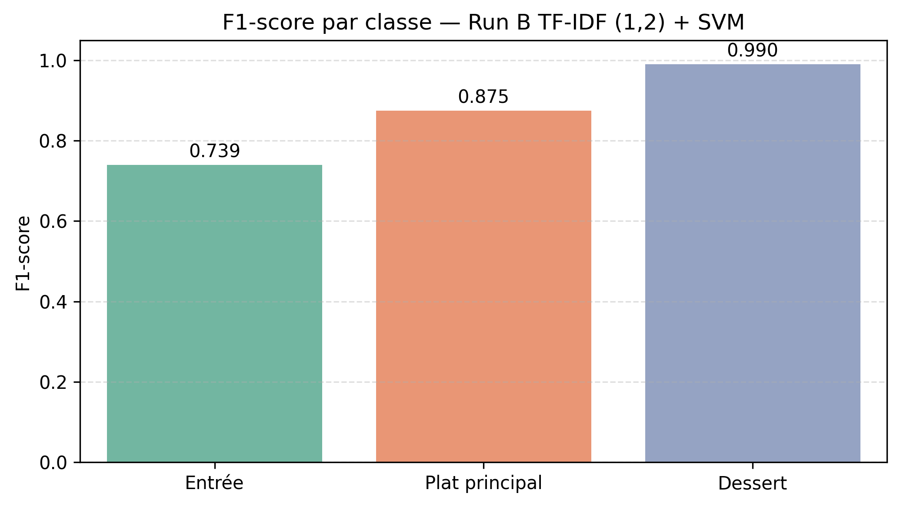

 Conclusion :  
- Le SVM est le **meilleur modèle parmi ceux testés**
- Très adapté aux données textuelles

###  Méthode C : Modèle enrichi

**Description :**
- TF-IDF (uni + bi-grammes)
- Ajout de features :
  - mots spécifiques par classe
  - longueurs des textes

**Résultats :**
- micro-F1 : 0.869  
- macro-F1 : 0.860  

**Analyse :**
- Les features ajoutées n’améliorent pas significativement les performances
- Le modèle reste proche du SVM simple

Conclusion :  
- Les informations ajoutées sont déjà capturées par TF-IDF
- Complexifier le modèle n’apporte pas toujours un gain

## Comparaison des méthodes

| Méthode                     | micro-F1 | macro-F1 |
|----------------------------|----------:|----------:|
| Naive Bayes                | 0.805     | 0.732     |
| Logistic Regression        | 0.872     | 0.859     |
| SVM (LinearSVC)            | 0.878     | 0.868     |
| Modèle enrichi             | 0.869     | 0.860     |

### visualisation : 
La figure suivante résume les performances obtenues :

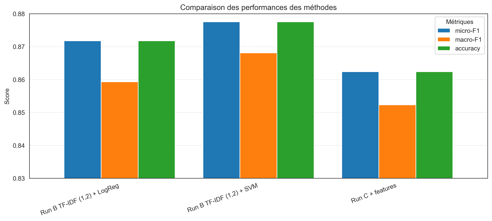

Comme on peut le voir :
- Les modèles linéaires (Logistic Regression, SVM) sont **nettement meilleurs**
- Le passage aux **n-grammes améliore les performances**
- Le SVM donne les meilleurs résultats globaux
- Le problème principal reste :
  → distinction **Entrée vs Plat principal**


## Analyse des résultats

### Analyse quantitative

#### Comparaison globale des méthodes

L’analyse globale des résultats montre une progression nette entre les familles de modèles :

| Méthode | micro-F1 | macro-F1 | accuracy |
|--------|---------:|---------:|---------:|
| Baseline aléatoire | 0.316 | 0.309 | 0.316 |
| Baseline majoritaire | 0.464 | 0.211 | 0.464 |
| Naive Bayes | 0.805 | 0.732 | 0.805 |
| Logistic Regression | 0.872 | 0.859 | 0.872 |
| SVM (LinearSVC) | **0.878** | **0.868** | **0.878** |
| Modèle enrichi | 0.869 | 0.860 | 0.869 |
| Modèle enrichi + longueurs | 0.867 | 0.858 | 0.867 |

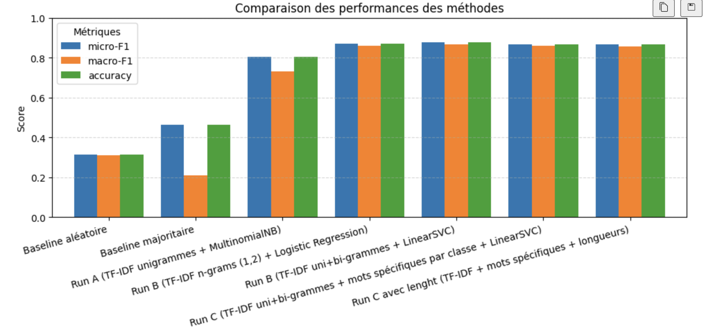

Les baselines montrent que la tâche n’est pas triviale. Naive Bayes apporte déjà un gain important, mais les meilleurs résultats sont obtenus avec les modèles linéaires, en particulier **TF-IDF + SVM**.

Dans notre cas, l’accuracy est égale au micro-F1 car il s’agit d’une tâche de **classification mono-classe**.

#### Score par classe

L’analyse des performances par classe montre que :
- **Dessert** est presque parfaitement reconnu
- **Plat principal** est bien classé
- **Entrée** reste la classe la plus difficile

La faiblesse principale du modèle concerne donc la détection des entrées, ce qui est cohérent avec les observations faites lors de l’exploration des données.

#### Impact du déséquilibre

Le corpus est déséquilibré, avec une majorité de *plats principaux*. Cela explique pourquoi la baseline majoritaire obtient une accuracy artificiellement correcte.

Ce déséquilibre pénalise surtout la classe **Entrée**, qui est à la fois :
- moins représentée
- lexicalement proche de *Plat principal*

Cela justifie l’utilisation du **macro-F1**, qui donne le même poids à chaque classe.

###  Analyse qualitative

#### Bonnes prédictions

Les bonnes prédictions concernent surtout les **desserts**, car cette classe possède un vocabulaire très spécifique. Comme le montre la figure des mots spécifiques par classe, certains termes comme *biscuit*, *ganache*, *pralin* ou *chocolat* donnent des indices très forts au modèle.

On observe aussi que, dans certains cas, les **titres seuls** suffisent à bien prédire la classe, lorsqu’ils contiennent des indices lexicaux explicites.

#### Erreurs typiques

Les erreurs typiques concernent principalement la confusion entre :
- **Entrée**
- **Plat principal**

Ces classes partagent souvent :
- des ingrédients proches
- des modes de préparation similaires
- des intitulés peu explicites

La difficulté principale n’est donc pas de distinguer un dessert d’un plat salé, mais de séparer correctement deux types de recettes salées proches.

#### Recettes ambiguës

Certaines recettes sont intrinsèquement ambiguës :
- une quiche peut être servie en entrée ou en plat
- une salade peut être une entrée ou un plat principal

Cette ambiguïté ne dépend pas seulement du modèle, mais aussi de la définition même des classes dans le corpus.

### Interprétabilité

####  Mots les plus discriminants

Les mots les plus spécifiques par classe confirment les tendances observées :

- **Dessert** : biscuit, ganache, pralin, chocolat, pâtissière
- **Entrée** : huîtres, rémoulade, dolmas, samoussa
- **Plat principal** : cailles, pintade, gnocchis, gigot

On remarque surtout que les mots associés à *Dessert* sont beaucoup plus discriminants que ceux des autres classes.

#### Pourquoi la meilleure méthode fonctionne-t-elle ?

La meilleure méthode est **TF-IDF (1,2) + SVM**. Elle fonctionne bien pour deux raisons principales :
- **TF-IDF** met en valeur les mots les plus informatifs et réduit l’importance des mots trop fréquents
- les **bi-grammes** permettent de capturer de petites expressions plus précises que les unigrammes seuls

Cette approche est particulièrement efficace pour les classes avec un vocabulaire très spécifique, tout en restant robuste sur les classes plus proches.

---

## Réflexion critique sur le projet

###  Points forts

- Les résultats montrent que le problème est **bien modélisable** avec des méthodes classiques.
- Le pipeline expérimental est **rigoureux** :
  - séparation train/test respectée
  - comparaison équitable entre méthodes
- Les analyses sont **cohérentes avec les données** :
  - forte performance sur les desserts
  - difficulté sur les entrées

###  Limites du projet

1. **Ambiguïté de la tâche**
Certaines recettes peuvent raisonnablement appartenir à plusieurs catégories. La limite ne vient donc pas uniquement du modèle, mais aussi de la définition même des classes.

2. **Déséquilibre des classes**

Les plats principaux sont plus représentés, ce qui peut biaiser les modèles et pénaliser les classes minoritaires.

3. **Difficulté Entrée vs Plat principal**
Ces deux classes partagent un vocabulaire proche et une frontière sémantique parfois floue, ce qui explique l’essentiel des erreurs observées.

## Conclusion générale

Ce projet montre que :
- les approches classiques (TF-IDF + modèles linéaires) sont **très efficaces**
- le principal défi n’est pas technique, mais **lié aux données (ambiguïté, similarité des classes)**

 Le meilleur modèle obtenu (SVM) atteint des performances élevées (~0.88),  
ce qui confirme la **pertinence des méthodes utilisées**.

---