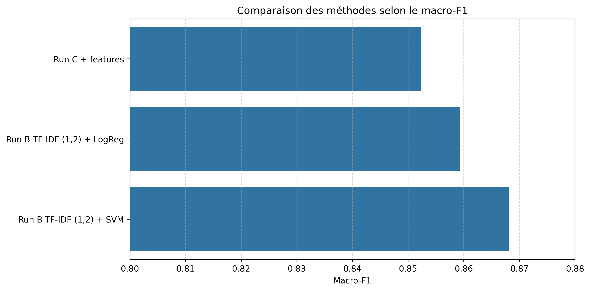
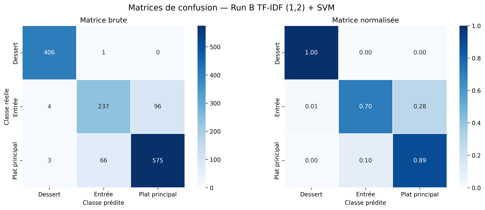

# Analyse des résultats

## Analyse quantitative

### Score global

Les baselines montrent bien que la tâche n’est pas triviale :

- **Baseline aléatoire** : très mauvais résultats.
- **Baseline majoritaire** : accuracy correcte en apparence, mais très mauvais macro-F1 car elle ignore les classes minoritaires.

La figure de comparaison des méthodes montre que **Run B TF-IDF (1,2) + SVM** est le meilleur modèle, avec les meilleurs scores globaux (accuracy 0.878, micro-F1 0.878, macro-F1 0.868).

Dans notre cas, l’accuracy est égale au micro-F1, car chaque recette appartient à une seule classe.

Le modèle Naive Bayes (méthode A) améliore nettement les baselines, mais reste moins performant que les modèles linéaires sur TF-IDF. Le SVM est légèrement meilleur que la régression logistique.

#### Tableau des performances globales

| Méthode                     |   micro-F1 |   macro-F1 |   accuracy |
|:----------------------------|-----------:|-----------:|-----------:|
| Baseline aléatoire          |      0.316 |      0.309 |      0.316 |
| Baseline majoritaire        |      0.464 |      0.211 |      0.464 |
| Run A unigrammes + NB       |      0.805 |      0.732 |      0.805 |
| Run B TF-IDF (1,2) + LogReg |      0.872 |      0.859 |      0.872 |
| Run B TF-IDF (1,2) + SVM    |      0.878 |      0.868 |      0.878 |
| Run C + features            |      0.862 |      0.852 |      0.862 |

### Score par classe

Avec le meilleur modèle, la figure du F1-score par classe montre que Dessert est presque parfaitement reconnu, et que les plats principaux sont eux aussi bien reconnus.

La principale faiblesse du modèle concerne donc la détection des entrées (F1-score de 0.739).

#### Tableau des scores par classe — Run B TF-IDF (1,2) + SVM

| Classe         |   Précision |   Rappel |   F1-score |   Support |
|:---------------|------------:|---------:|-----------:|----------:|
| Dessert        |       0.983 |    0.998 |      0.99  |       407 |
| Entrée         |       0.78  |    0.703 |      0.739 |       337 |
| Plat principal |       0.857 |    0.893 |      0.875 |       644 |

### Matrice de confusion

Pour la matrice de confusion, nous avons généré deux heatmaps afin d’analyser les résultats : une avec les valeurs brutes et l’autre avec les valeurs normalisées. Un score de 1 sur la matrice normalisée indique une prédiction parfaite pour la classe concernée.

La matrice montre que Dessert est presque toujours bien classé. Il y a très peu de confusion entre Dessert et les classes salées, tandis que la plupart des erreurs viennent de la confusion entre Entrée et Plat principal.

Généralement, Entrée → Plat principal est l’erreur la plus fréquente, même si l’on observe aussi des erreurs Plat principal → Entrée, mais de façon moins fréquente.

Cela montre que la vraie difficulté du problème n’est pas de distinguer sucré / salé, mais plutôt de séparer correctement Entrée et Plat principal.

#### Matrice brute

| Classe réelle   |   Dessert |   Entrée |   Plat principal |
|:----------------|----------:|---------:|-----------------:|
| Dessert         |       406 |        1 |                0 |
| Entrée          |         4 |      237 |               96 |
| Plat principal  |         3 |       66 |              575 |

#### Matrice normalisée

| Classe réelle   |   Dessert |   Entrée |   Plat principal |
|:----------------|----------:|---------:|-----------------:|
| Dessert         |     0.998 |    0.002 |            0     |
| Entrée          |     0.012 |    0.703 |            0.285 |
| Plat principal  |     0.005 |    0.102 |            0.893 |

### Impact du déséquilibre

Le jeu de données est déséquilibré : la classe Plat principal est plus représentée que les autres.

Cela a pour conséquence que la baseline majoritaire obtient une accuracy artificiellement correcte. Cela justifie l’utilisation du macro-F1, qui donne la même importance à chacune des classes et qui doit donc être utilisé en complément de l’accuracy.

Le déséquilibre pénalise surtout la classe Entrée, qui est à la fois moins représentée et plus proche lexicalement de Plat principal.

#### Répartition des classes

| Classe         |   Train |   Test |
|:---------------|--------:|-------:|
| Plat principal |   0.465 |  0.464 |
| Dessert        |   0.302 |  0.293 |
| Entrée         |   0.233 |  0.243 |

## Analyse qualitative

### Exemples de bonnes prédictions

Les bonnes prédictions concernent surtout les desserts, car cette classe possède un vocabulaire très spécifique.

Les performances par classe montrent que Dessert est presque parfaitement reconnu, ce qui indique que certains mots donnent des indices très forts au modèle.

Comme on le voit sur la figure des mots les plus spécifiques par classe, les mots associés aux desserts ont des ratios de spécificité beaucoup plus élevés que ceux des autres classes. Des termes comme biscuit, ganache, pralin, chocolat ou pâtissière sont très fortement liés à la classe Dessert. Cela montre que le vocabulaire des desserts est plus discriminant, ce qui explique pourquoi cette classe est la mieux prédite.

On observe aussi que les titres seuls sont déjà assez informatifs. Pour certaines recettes, le nom contient directement des indices de classe, ce qui augmente les chances d’une bonne prédiction même sans analyser tout le texte.

### Exemples d’erreurs typiques

Les erreurs typiques concernent principalement la confusion entre Entrée et Plat principal.

Les recettes salées partageant des ingrédients proches, un mode de préparation similaire ou un intitulé peu explicite sont les plus difficiles à classer correctement. En pratique, l’erreur typique n’est donc pas de confondre un dessert avec un plat, mais plutôt de mal séparer deux recettes salées proches.

### Recettes ambiguës

Les recettes ambiguës sont surtout celles situées à la frontière entre Entrée et Plat principal.

L’exploration menée dans le notebook montre déjà cette tendance : même avec le texte complet, l’ambiguïté reste forte entre ces deux classes, alors que Dessert reste beaucoup plus facile à reconnaître.

Cette ambiguïté peut venir du fait que certaines recettes peuvent raisonnablement être servies soit en petite portion comme entrée, soit en portion plus importante comme plat principal. Le problème ne vient donc pas seulement du modèle, mais aussi du fait que la frontière entre ces deux catégories est parfois floue dans les données elles-mêmes.

### Différences entre Entrée et Plat principal

La différence entre Entrée et Plat principal est moins nette que celle entre Dessert et les recettes salées. Les figures montrent que le modèle a plus de mal à séparer ces deux classes, ce qui suggère qu’elles partagent une partie de leur vocabulaire et de leur structure.

Les plats principaux semblent globalement mieux reconnus que les entrées, probablement parce qu’ils sont plus nombreux dans le corpus et qu’ils présentent des indices lexicaux plus stables. À l’inverse, les entrées forment une catégorie plus hétérogène, ce qui rend leur détection plus difficile.

Les statistiques de longueur vont dans le même sens : les plats principaux sont en moyenne un peu plus longs que les entrées, aussi bien pour les ingrédients que pour la recette complète. Cependant, les écarts restent modestes, ce qui montre que la longueur seule ne suffit pas à distinguer clairement les classes. Elle peut aider en complément, mais le vocabulaire reste l’indice le plus discriminant.

#### Statistiques de longueur des ingrédients

| Classe         |   count |   mean |   std |   min |   median |   max |
|:---------------|--------:|-------:|------:|------:|---------:|------:|
| Dessert        |    3762 |  45.55 | 21.32 |     7 |       41 |   223 |
| Entrée         |    2909 |  44.44 | 18.95 |     8 |       41 |   149 |
| Plat principal |    5802 |  49.59 | 22.05 |     8 |       46 |   232 |
| Total          |   12473 |  47.17 | 21.26 |     7 |       43 |   232 |

#### Statistiques de longueur de la recette

| Classe         |   count |   mean |   std |   min |   median |   max |
|:---------------|--------:|-------:|------:|------:|---------:|------:|
| Dessert        |    3762 | 125.56 | 77.35 |     9 |      108 |  1334 |
| Entrée         |    2909 | 112.62 | 58.33 |    14 |      101 |   638 |
| Plat principal |    5802 | 127.73 | 65.01 |    13 |      114 |  1213 |
| Total          |   12473 | 123.55 | 67.83 |     9 |      109 |  1334 |

#### Statistiques de longueur du texte

| Classe         |   count |   mean |   std |   min |   median |   max |
|:---------------|--------:|-------:|------:|------:|---------:|------:|
| Dessert        |    3762 | 176    | 90.84 |    33 |    155   |  1450 |
| Entrée         |    2909 | 162.2  | 69.33 |    25 |    149   |   763 |
| Plat principal |    5802 | 182.59 | 78.81 |    44 |    166.5 |  1440 |
| Total          |   12473 | 175.85 | 81.01 |    25 |    159   |  1450 |

## Interprétabilité

### Quels mots sont les plus discriminants ?

La figure des mots les plus spécifiques par classe montre que certains termes sont très fortement associés à une seule catégorie.

- **Dessert** : biscuit, ganache, pralin, chocolat, pâtissière, meringue, biscuits, frangipane
- **Entrée** : dénervé, huîtres, rémoulade, dolmas, cassolettes, samoussa, émulsionnant, tourin
- **Plat principal** : cailles, pintade, gnocchis, côtelettes, chapon, seiches, gigot, macaroni

On remarque surtout que les mots associés à Dessert ont des ratios de spécificité beaucoup plus élevés que ceux des autres classes, ce qui confirme que le vocabulaire des desserts est le plus discriminant.

### Pourquoi la meilleure méthode fonctionne-t-elle ?

**TF-IDF (1,2) + SVM** fonctionne bien pour deux raisons principales. D’abord, **TF-IDF** met en valeur les mots les plus informatifs pour la classification et réduit l’importance des mots trop fréquents. Ensuite, l’utilisation des **bigrammes** permet de capturer de petites expressions plus précises que les unigrammes seuls.

Cette méthode fonctionne particulièrement bien sur Dessert, car cette classe possède un vocabulaire très spécifique, mais elle reste plus en difficulté sur la séparation entre Entrée et Plat principal, qui partagent un lexique plus proche.